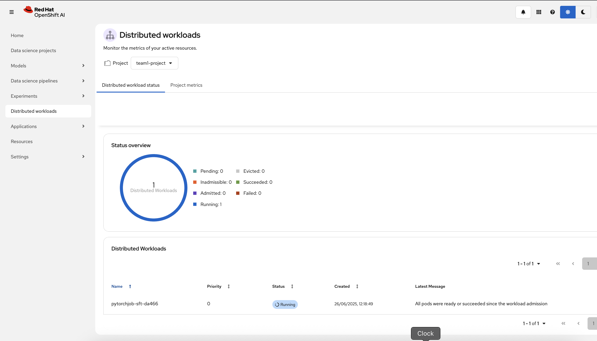
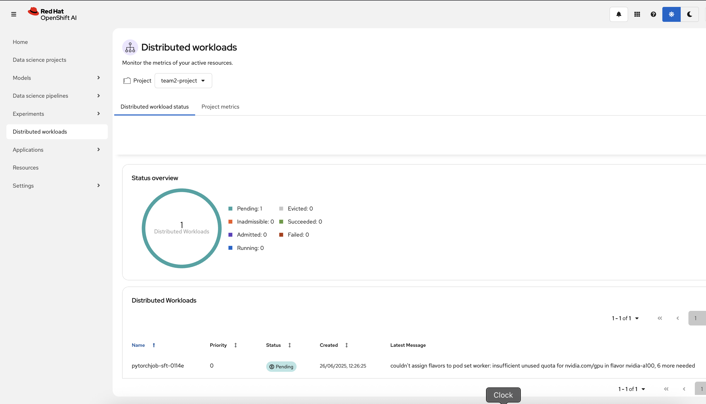
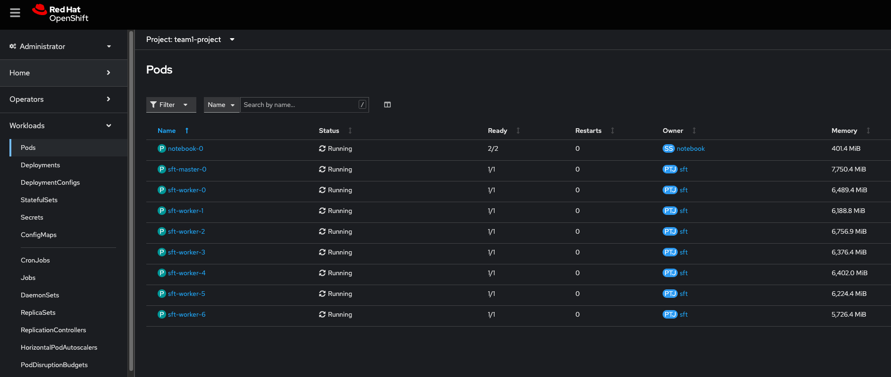
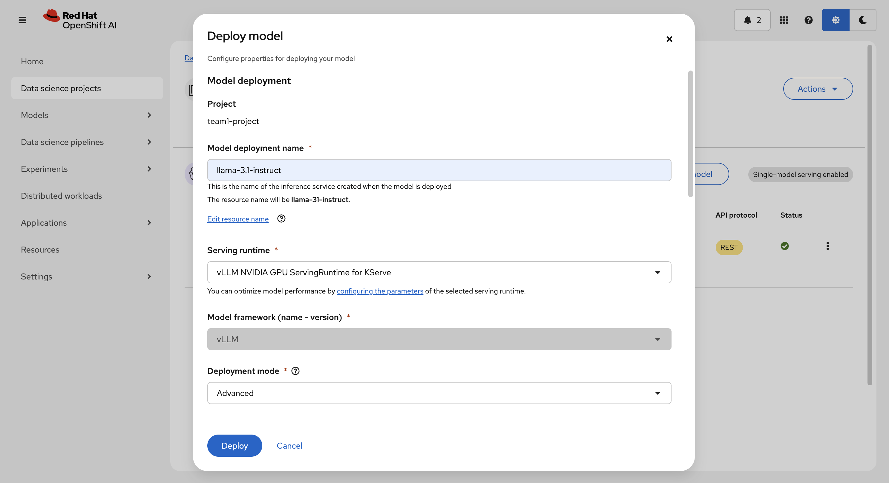
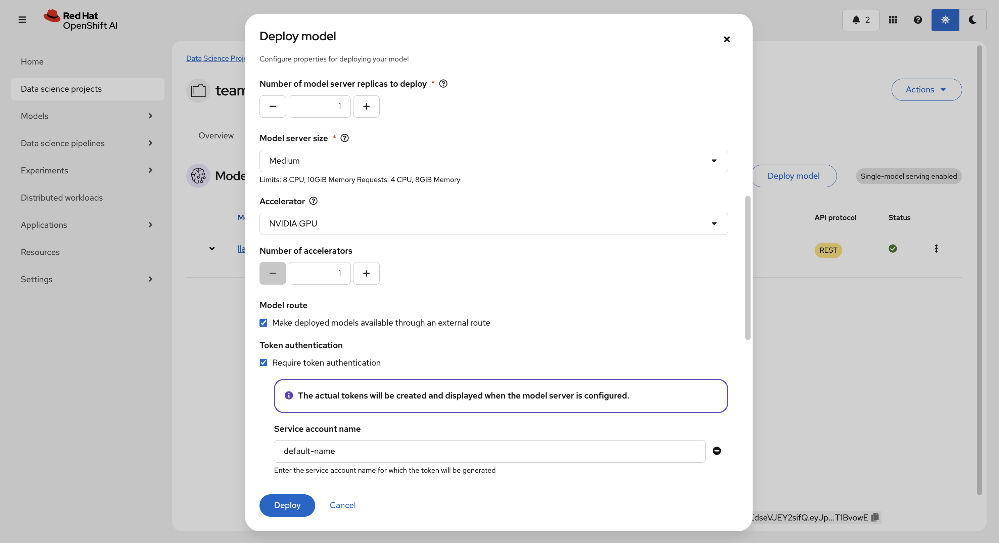
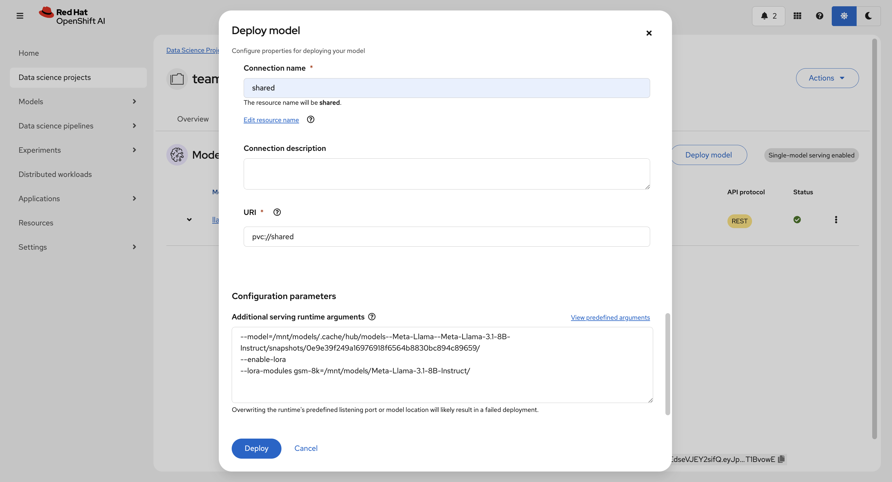

# Kueue Multi-Team Resource Management Workshop

This workshop demonstrates how to use Kueue for multi-team GPU resource management and workload scheduling on OpenShift AI. Using LLM fine-tuning jobs as a practical demonstration, you'll learn how to:
- Configure Kueue for enterprise-grade resource sharing and quotas
- Set up multi-team environments with fair resource allocation
- Implement borrowing and preemption policies between teams
- Manage workload priorities and scheduling strategies
- Monitor resource usage across teams using distributed training jobs

The workshop uses Large Language Model fine-tuning with Kubeflow Training Operator to demonstrate real-world GPU-intensive workloads and resource contention scenarios.

## Kueue Resource Architecture

The following diagram illustrates how Kueue manages resources in this workshop:

```
Kueue Resource Hierarchy - Workshop Configuration
================================================

Resource Layer (Hardware Abstraction)
├── ResourceFlavor: nvidia-a100
│   └── Node Labels: NVIDIA-A100-SXM4-80GB
└── ResourceFlavor: amd-mi300x
    └── Node Labels: AMD-Instinct-MI300X

Organization Layer (Cohort: "organization")
├── ClusterQueue: team1
│   ├── Quota: 5x A100 GPUs, 256 CPU, 2000Gi Memory
│   ├── Preemption: Can reclaim from cohort
│   └── Borrowing: Can use unused team2 resources ←─┐
│                                                   │
└── ClusterQueue: team2                             │
    ├── Quota: 5x A100 GPUs, 256 CPU, 2000Gi Memory │
    ├── Preemption: Can reclaim from cohort         │
    └── Borrowing: Can use unused team1 resources ──┘

Project Layer (Team Access Points)
├── Team 1 Sub-teams: (→ team1 ClusterQueue)
│   ├── LocalQueue: team1-alpha
│   │   └── Project: team1-project → PyTorchJob: sft-training
│   │
│   └── LocalQueue: team1-beta
│       └── Project: team1-project → PyTorchJob: inference-serving
│
└── Team 2 Sub-teams: (→ team2 ClusterQueue)
    ├── LocalQueue: team2-alpha
    │   └── Project: team2-project → PyTorchJob: sft-training
    │
    └── LocalQueue: team2-beta
        └── Project: team2-project → PyTorchJob: model-evaluation


Queue Relationship:
==================
team1-alpha (LocalQueue) ─┐
team1-beta  (LocalQueue) ─┤→ team1 (ClusterQueue) → nvidia-a100/amd-mi300x (ResourceFlavors)
                          │
team2-alpha (LocalQueue) ─┐
team2-beta  (LocalQueue) ─┤→ team2 (ClusterQueue) → nvidia-a100/amd-mi300x (ResourceFlavors)


Resource Flavor Selection Flow:
==============================
┌─────────────────────────────┐    ┌─────────────────────────────────┐
│ PyTorchJob (team1-alpha)    │    │        Kueue Scheduler          │
│                             │    │                                 │
│ nodeSelector:               │    │ 1. Examines workload specs      │
│   nvidia.com/gpu.product:   │────┤ 2. Matches nodeSelector         │──> nvidia-a100 flavor
│   "NVIDIA-A100-SXM4-80GB"   │    │ 3. Checks available quota       │    (uses team1 quota)
│                             │    │ 4. Schedules on matching nodes  │
│ tolerations:                │    │                                 │
│   - key: nvidia.com/gpu     │    │                                 │
└─────────────────────────────┘    └─────────────────────────────────┘

┌─────────────────────────────┐    ┌─────────────────────────────────┐
│ PyTorchJob (team1-beta)     │    │        Kueue Scheduler          │
│                             │    │                                 │
│ nodeSelector:               │    │ 1. Examines workload specs      │
│   amd.com/gpu.product:      │────┤ 2. Matches nodeSelector         │──> amd-mi300x flavor
│   "AMD-Instinct-MI300X"     │    │ 3. Checks available quota       │    (uses team1 quota)
│                             │    │ 4. Schedules on matching nodes  │
│ tolerations:                │    │                                 │
│   - key: amd.com/gpu        │    │                                 │
└─────────────────────────────┘    └─────────────────────────────────┘

Multi-Queue Scenarios:
=====================
**Basic Resource Sharing:**
1. team1-alpha + team1-beta both submit jobs → Share team1's quota (5 GPUs total)
2. team2-alpha submits large job → Uses all team2 quota + borrows from team1
3. team1-beta submits urgent job → Preempts team2's borrowed resources
4. Mixed GPU usage: team1-alpha uses A100, team1-beta uses MI300X (via nodeSelector)

**Advanced Scenarios:**
5. **Priority-based scheduling:** team1-alpha (high priority) preempts team1-beta (low priority) within same team
6. **Resource flavor exhaustion:** team1-alpha requests A100s but only MI300X available → job stays pending
7. **Cohort resource limits:** Both teams at capacity → new jobs wait until resources freed
8. **Resource reclamation:** team1 jobs return, automatically reclaim resources borrowed by team2
9. **Batch job conflicts:** Multiple teams submit jobs simultaneously → fair scheduling across teams
10. **Workload failure recovery:** Failed job releases resources immediately for other waiting jobs
11. **Administrative controls:** LocalQueue suspended → jobs pause until queue resumed
12. **Mixed workload types:** PyTorchJobs + regular Jobs + Deployments all sharing same quotas
```

**Key Concepts:**

**Basic Components:**
- **ResourceFlavor** - Defines hardware characteristics and node labels (e.g., NVIDIA A100 GPUs, AMD MI300X)
- **ClusterQueue** - Organization-level resource pool with quotas, policies, and scheduling strategies
- **LocalQueue** - Team/project-level access point that connects to a ClusterQueue
- **Workload** - Actual job submission (PyTorchJob, Job, etc.) that gets queued and scheduled

**Resource Management:**
- **Cohort** - Shared resource pool allowing multiple ClusterQueues to borrow from each other
- **Quota** - Guaranteed resource allocation per ClusterQueue (e.g., 5 GPUs, 256 CPU cores)
- **Borrowing** - Using unused resources from other ClusterQueues in the same cohort
- **Preemption** - Forcefully stopping jobs to free up resources for higher priority workloads

**Scheduling Policies:**
- **BestEffortFIFO** - Fair scheduling strategy that processes jobs in order while considering resource availability
- **reclaimWithinCohort: Any** - Can preempt any workload in the cohort to reclaim resources
- **borrowWithinCohort: Never** - Cannot preempt other teams' workloads to borrow resources
- **withinClusterQueue: LowerOrNewerEqualPriority** - Can preempt lower/equal priority jobs within the same team

**Workload States:**
- **Pending** - Job submitted but waiting for resources
- **Admitted** - Job accepted and resources reserved
- **Running** - Job actively executing on allocated resources
- **Finished** - Job completed successfully or failed

## Requirements

* An OpenShift cluster with admin permissions (for the setup steps)
* The `oc`, `curl`, and `git` (or equivalent) binaries installed locally
* Enough worker nodes with NVIDIA GPUs (Ampere-based or newer recommended) or AMD GPUs (AMD Instinct MI300X)
* The NFD operator and the NVIDIA GPU operator or AMD GPU operator installed and configured 
* A dynamic storage provisioner supporting RWX PVC provisioning (or see the NFS provisioner section)

## Workshop Flow

1. Set up the infrastructure (OpenShift AI, storage)
2. Configure Kueue for multi-team resource management
3. Create team projects and workbenches
4. Run fine-tuning jobs with Kubeflow Training
5. Monitor training progress with TensorBoard
6. Deploy and serve fine-tuned models

## Setup

### Install OpenShift AI

* Log into your OpenShift Web console
* Go to "Operators" > "OperatorHub" > "AI/Machine Learning"
* Select the "Red Hat OpenShift AI" operator
* Install the latest version and create a default DataScienceCluster resource

### Checkout the workshop

* Clone the following repository:
    ```console
    git clone https://github.com/opendatahub-io/distributed-workloads.git
    ```
* Change directory:
    ```console
    cd workshops/kueue
    ```

### NFS Provisioner (optional)

> [!NOTE]
> Skip this section if your cluster already has a PVC dynamic provisioner with RWX support.

* Install the NFS CSI driver:
    ```console
    curl -skSL https://raw.githubusercontent.com/kubernetes-csi/csi-driver-nfs/v4.9.0/deploy/install-driver.sh | bash -s v4.9.0 --
    ```
* Create a new project:
    ```console
    oc new-project nfs
    ```
* Deploy the in-cluster NFS server:
    ```console
    oc apply -f nfs/nfs_deployment.yaml
    ```
* Create the NFS StorageClass:
    ```console
    oc apply -f nfs/nfs_storage_class.yaml
    ```

### Configure RHOAI Storage

* Go to the OpenShift AI Dashboard (accessible from the applications menu in the top navigation bar)
* Go to "Settings" > "Storage classes"
* Check the storage class supporting RWX PVC provisioning you plan to use, or the `nfs-csi` one if created previously, is enabled

## Manage Quotas with Kueue

This workshop demonstrates how to manage resources between multiple teams using Kueue. We'll create two ClusterQueues that simulate two teams/projects with resource sharing capabilities through cohort configuration.

### Resource Flavor Setup

* Update the `nodeLabels` in the `resources/resource_flavor.yaml` file to match those of your AI worker nodes
* Apply the ResourceFlavor:
    ```console
    oc apply -f resources/resource_flavor.yaml
    ```

### Configure Team ClusterQueues

The workshop provides two pre-configured ClusterQueues (`team1` and `team2`) that demonstrate resource management between teams:

* Each team gets dedicated resource quotas
* Resources are managed within an organization cohort
* Fair scheduling with BestEffortFIFO strategy

Create the ClusterQueues:
```console
oc apply -f resources/team1_cluster_queue.yaml
oc apply -f resources/team2_cluster_queue.yaml
```

### Understanding Workshop Queue Configuration

**Resource Allocation:**
* Each team gets a guaranteed quota (5 GPUs, 256 CPU, 2000Gi Memory)
* Teams can borrow beyond their quota when other teams have unused resources
* Total cluster resources are shared within the "organization" cohort

**Preemption Policies in This Workshop:**
* `borrowWithinCohort: Never` - Teams cannot preempt other teams' workloads to borrow resources
* `reclaimWithinCohort: Any` - Teams can reclaim their own resources from any queue in the cohort
* `withinClusterQueue: LowerOrNewerEqualPriority` - Within a team, newer/higher priority jobs can preempt older/lower priority ones

**Expected Behavior:**
* Team1 can borrow Team2's unused resources (and vice versa)
* Teams can reclaim their own resources from anywhere in the cohort
* Teams cannot use preemption to borrow beyond their nominal quota
* This balances job stability with fair resource access

## Set Up Team Environments

### Create Projects for Teams

For each team/project:

1. Go to the OpenShift AI Dashboard
2. Go to "Data Science Projects"
3. Click "Create project"
4. Choose a name (e.g., `team1-project`, `team2-project`) and click "Create"

### Create Local Queues

Create LocalQueues to connect each team's project to their ClusterQueue:

* Team 1:
    ```console
    oc apply -f resources/team1_local_queue.yaml -n team1-project
    ```

* Team 2:
    ```console
    oc apply -f resources/team2_local_queue.yaml -n team2-project
    ```

### Create Workbenches

For each team:

* In their project, click "Create workbench"
* Enter a name
* Select the "Pytorch" (or the `ROCm-PyTorch`) notebook image
* In "Cluster storage", click "Create storage"
* Enter `training-storage` as a name and select the storage class with RWX capability
* Enter a mount directory under `/opt/app-root/src/`
* Add one more mount directory under `/opt/app-root/src/shared` with 500GB storage size
* Click "Create workbench"
* Wait for the workbench to become ready and then open it


## Fine-Tune Llama 3.1 with Kubeflow Training

### Enable the Training Operator (if needed)

> [!NOTE]
> The Kubeflow Training Operator is enabled by default in Red Hat OpenShift AI v2.20 and later versions.

* If using an earlier version of RHOAI:
  1. In the OpenShift Web console, navigate to the DataScienceCluster resource
  2. Enable the training operator

### Create Fine-Tuning PyTorchJobs

In each team's workbench, follow these steps:

**Step 1: Clone and prepare the repository**
* Clone https://github.com/opendatahub-io/distributed-workloads.git
* Navigate to "distributed-workloads/examples/kfto-sft-llm"
* Open the "sft.ipynb" notebook

**Step 2: Configure authentication**
* Get your cluster API server URL and authorization token:
  * Option 1: Run `oc whoami -t` in your terminal
  * Option 2: In OpenShift Web console, click your username > "Copy login command"

**Step 3: Configure the training job**
* Review and adjust the training parameters:
  * Model configuration (Flash Attention 2, Liger kernels)
  * PEFT settings (adapter type, target modules)
  * Dataset settings (GSM8k for mathematical reasoning)
  * Training hyperparameters (batch size, learning rate, etc.)
  * **Customize `create_job()` arguments** based on your cluster's available GPU resources (e.g., adjust `num_workers`, `resources_per_worker`)
  * **Add `labels` argument** in `create_job()` with local-queue-name label - this enables Kueue workload management and is **required** for this workshop
* Add `HF_TOKEN` environment variable if using gated models (the examples use gated Llama models that require a token)
  > [!NOTE]
  > - This workshop requires Red Hat OpenShift AI v2.21+ with Kubeflow Training SDK v1.9.2+ for full Kueue integration support. 
  > - Ensure you have access to [Llama-3.1 model](https://huggingface.co/meta-llama/Llama-3.1-8B)

**Step 4: Submit the job**

After submitting your job, verify your Kueue setup by checking the resource status:

```
$ oc project team1-project && oc get resourceflavors,clusterqueues,localqueues,pytorchjobs,workloads -o wide

NAME                                           AGE
resourceflavor.kueue.x-k8s.io/default-flavor   51d
resourceflavor.kueue.x-k8s.io/nvidia-a100      142m

NAME                                        COHORT         STRATEGY         PENDING WORKLOADS   ADMITTED WORKLOADS
clusterqueue.kueue.x-k8s.io/team1           organization   BestEffortFIFO   0                   1
clusterqueue.kueue.x-k8s.io/team2           organization   BestEffortFIFO   1                   0

NAME                                    CLUSTERQUEUE   PENDING WORKLOADS   ADMITTED WORKLOADS
localqueue.kueue.x-k8s.io/team1-alpha   team1          0                   1

NAME                          STATE     AGE
pytorchjob.kubeflow.org/sft   Running   95m

NAME                                           QUEUE         RESERVED IN   ADMITTED   FINISHED   AGE
workload.kueue.x-k8s.io/pytorchjob-sft-da466   team1-alpha   team1         True                  95m
```

```
$ oc project team2-project && oc get localqueues,pytorchjobs,workloads -o wide

NAME                                    CLUSTERQUEUE   PENDING WORKLOADS   ADMITTED WORKLOADS
localqueue.kueue.x-k8s.io/team2-alpha   team2          1                   0

NAME                          STATE       AGE
pytorchjob.kubeflow.org/sft   Suspended   90m

NAME                                           QUEUE         RESERVED IN   ADMITTED   FINISHED   AGE
workload.kueue.x-k8s.io/pytorchjob-sft-0114e   team2-alpha                                       89m

```








### Monitor Job Scheduling with Kueue

**Monitor Resource Status:**

```console
# Check all Kueue resources for a team
oc get resourceflavors,clusterqueues,localqueues,pytorchjobs,workloads -o wide

# Check PyTorchJob status specifically
oc get pytorchjobs -n <team-namespace>

# Check Kueue workload status
oc get workloads -n <team-namespace>
```

**Check Detailed Information:**
```console
# Check admission status and details
oc describe workload <workload-name> -n <team-namespace>

# Check borrowing status for a cluster queue
oc get clusterqueue <queue-name> -o jsonpath='{.status.flavorsReservation[0].resources[2]}'
```

**Understanding the Monitoring Output:**
* **Pending vs Admitted**: Jobs exceeding team quotas will show as "Pending" until resources become available
* **Borrowing behavior**: See the "Understanding Workshop Queue Configuration" section above for detailed explanation of borrowing and preemption policies

### Monitor Training Progress

For each team's PyTorchJob, monitor training metrics directly from the workbench using TensorBoard:

**From the team's workbench notebook:**

1. Set up TensorBoard proxy environment:
    ```python
    import os
    os.environ["TENSORBOARD_PROXY_URL"] = os.environ["NB_PREFIX"] + "/proxy/6006/"
    ```

2. Load TensorBoard extension:
    ```python
    %load_ext tensorboard
    ```

3. Start TensorBoard:
    ```python
    %tensorboard --logdir /opt/app-root/src/shared
    ```

4. TensorBoard will be accessible directly within the notebook interface.

**What you can monitor:**
* Training loss and evaluation metrics
* Learning rate schedule
* GPU utilization and memory usage
* Training throughput (tokens/second)

## Deploy Fine-Tuned Models

After training completes, each team can deploy their models:

1. In the OpenShift AI Dashboard, go to the team's project and then Models section
2. Click "Deploy model"
3. Configure the serving environment:
   * Select the appropriate serving runtime (e.g., vLLM, OpenVINO, ONNX)
     
   * Select model server deployment configuration, accelerators and route to make it accessible outside cluster
     
   * Connect PVC containing pretrained model using `URI-v1` connection type
   * Provide additional serving runtime arguments (e.g., model-path):
     ```example
     --model=/mnt/models/.cache/hub/models--Meta-Llama--Meta-Llama-3.1-8B-Instruct/snapshots/0e9e39f249a16976918f6564b8830bc894c89659/
     --enable-lora
     --lora-modules gsm-8k=/mnt/models/Meta-Llama-3.1-8B-Instruct/
     ```
     
   * Provide additional environment variables if needed

4. Click "Deploy"
   

The deployed models will be managed by the same Kueue resource quotas as the training jobs, ensuring fair resource allocation between teams.

Monitor model serving metrics and logs through the OpenShift AI Dashboard to ensure optimal performance within allocated resources.

## Verify Deployed Fine-Tuned Model

Test the deployed model with a sample GSM8k mathematical reasoning question:

```bash
# Set your model endpoint and token
export EXTERNAL_ENDPOINT="https://your-model-endpoint.apps.cluster.com"
export OPENAI_API_KEY="your-token-here"  # May not be required for vLLM

# Test the fine-tuned model
curl -k "$EXTERNAL_ENDPOINT/v1/chat/completions" \
    -H "Content-Type: application/json" \
    -H "Authorization: Bearer $OPENAI_API_KEY" \
    -d '{
        "model": "llama-31-instruct",
        "messages": [
            {
                "role": "user",
                "content": "Janets ducks lay 16 eggs per day. She eats three for breakfast every morning and bakes muffins for her friends every day with four. She sells the remainder at the farmers market daily for $2 per fresh duck egg. How much in dollars does she make every day at the farmers market?"
            }
        ]
    }' | jq '.'
```

**Expected Response:**
The fine-tuned model should demonstrate improved mathematical reasoning capabilities, providing step-by-step solutions to mathematical problems like the GSM8k dataset it was trained on.
